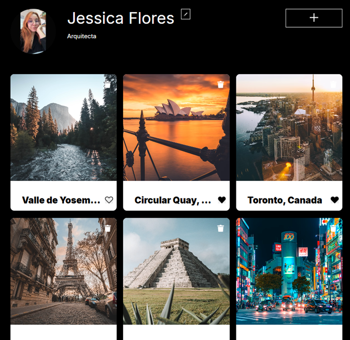
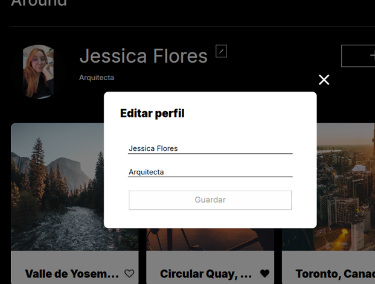
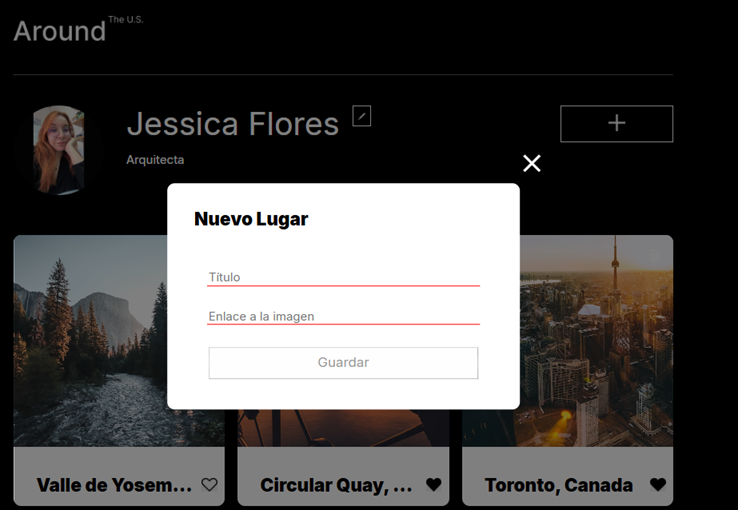

**Descripción**
Around es una aplicación web interactiva inspirada en plataformas como Instagram o Pinterest, donde los usuarios pueden explorar y gestionar tarjetas de lugares turísticos. Este proyecto representa una migración completa de una aplicación JavaScript vanilla a React, implementando componentes reutilizables, gestión de estado con hooks, y integración con una API externa para operaciones CRUD (Crear, Leer, Actualizar, Eliminar). Los usuarios pueden editar su perfil, avatar, dar likes a tarjetas, eliminarlas, y agregar nuevas ubicaciones con imágenes.

El proyecto se enfoca en la experiencia del usuario con popups modales para interacciones, validación de formularios, y actualizaciones en tiempo real de la interfaz.

**Funcionalidades Integradas**
- **Carga de Tarjetas Iniciales:** Al iniciar la aplicación, se obtienen y muestran tarjetas de lugares desde una API externa.
- **Edición de Perfil:** Los usuarios pueden actualizar su nombre y descripción personal mediante un formulario controlado en un popup.
- **Edición de Avatar:** Permite cambiar la foto de perfil usando un enlace de imagen, con acceso directo al DOM mediante useRef.
- **Interacción con Tarjetas:**
- **Likes: ** Dar o quitar likes a tarjetas, actualizando el estado local y la API.
- **Eliminación:** Borrar tarjetas propias, con confirmación y actualización de la lista.
- **Agregar Nuevas Tarjetas:** Crear y agregar tarjetas al inicio de la lista mediante un formulario con inputs para título y enlace de imagen.
- **Popups Modales:** Interfaz para todas las acciones (editar perfil, avatar, agregar tarjeta, ver imagen ampliada), con apertura y cierre automático tras operaciones.
- **Gestión de Estado:** Uso de useState, useEffect, y useContext para manejar datos globales como usuario actual y lista de tarjetas.
Validación de Formularios: Inputs con validación nativa (requeridos, min/max length) y manejo de errores.
Responsive Design: Estilos CSS para una experiencia fluida en diferentes dispositivos.

## Tecnologías Utilizadas
- **React:** Framework principal para construir la interfaz de usuario con componentes funcionales y hooks.
- **JavaScript** (ES6+): Lógica de la aplicación, incluyendo async/await para llamadas API.
- **HTML5:** Estructura semántica de los componentes.
- **CSS3:** Estilos personalizados para layout, popups, y responsividad.
- **Fetch API:** Para realizar solicitudes HTTP a la API externa (sin librerías adicionales como Axios).
- **Node.js y npm:** Gestión de dependencias y ejecución del proyecto.
- **Git:** Control de versiones (asumido para el desarrollo).

## Imágenes y Capturas de Pantalla

### Página Principal (Galería de Cards)

Vista inicial con header, perfil del usuario y grid de cards con imágenes, likes y botones de eliminar.

### Popup de Edición de Perfil

Popup modal con formulario para actualizar nombre y descripción, con validación en tiempo real.

### Agregar Nueva Imagen

Popup para subir una foto, con preview y campos para título y URL.

### Imagen Ampliada

Popup con imagen en grande, título y botón de cierre.

##### Autor

Autor:Jessica Flores

# Tripleten web_project_around_react